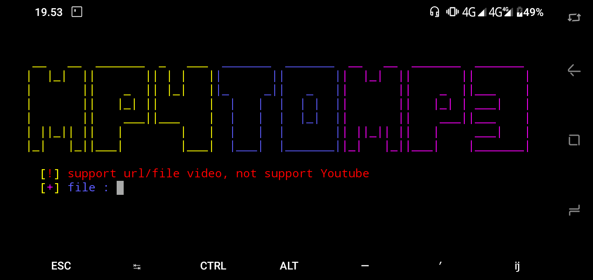

#installansi
```
$ apt update && apt upgrade
$ pkg install python3
$ pkg install git
$ pkg install ffmpeg
$ git clone https://github.com/krypton-byte/Mp4ToMp3
$ cd Mp4ToMp3
$ python3 -m pip install -r requirements.txt
$ python3 main.py
```
#screenshot

